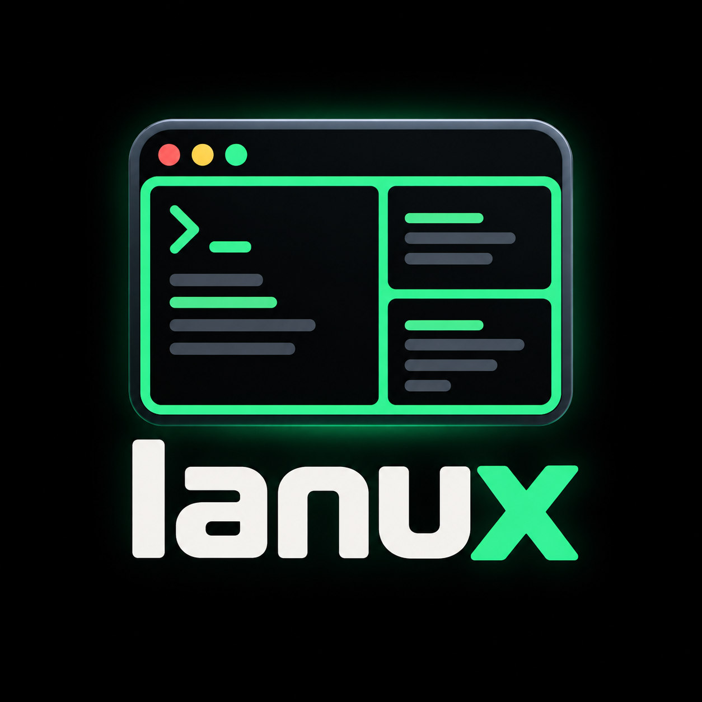

<div align="center">
  
  <h1>Ianux</h1>
  <p>A quick-to-use tmux wrapper for managing sessions.</p>
</div>

Ianux is a quick-to-use Python command-line tool for creating and restoring
multi-window, multi-pane tmux sessions, running detached jobs, and listing,
attaching to, or closing sessions. It requires Python 3.11+,
[uv](https://docs.astral.sh/uv/), and `tmux` on `PATH`.

## Quick start

Install Ianux as a standalone command:

```bash
uv tool install .
ianux --help
ianux session --panes 4
```

Or run it from a checkout:

```bash
uv sync
uv run ianux --help
uv run ianux session --panes 4
```

## Commands

| Command | Alias | Purpose |
|---|---|---|
| `session` | `s` | Create and attach to a multi-window, multi-pane session (default) |
| `run` | `r` | Run commands in a detached session |
| `list` | `ls` | List open sessions |
| `attach` | `a` | Attach to a session, window, or pane |
| `kill` | `k` | Close a session, window, or pane |
| `load` | `l` | Create a session from TOML |
| `dump` | `d` | Save a session's pane directories to TOML |

Run `ianux <command> --help` for options and examples. See the [wiki](wiki/Home.md)
for the [full command reference](wiki/Commands.md), [TOML configuration guide](wiki/Configuration.md),
and [architecture](wiki/Architecture.md).

## Development

```bash
uv sync
uv run pytest
uv build
```

End-to-end tests use a real tmux server and skip when `tmux` is unavailable.
See [Development and testing](wiki/Development.md) for details.
